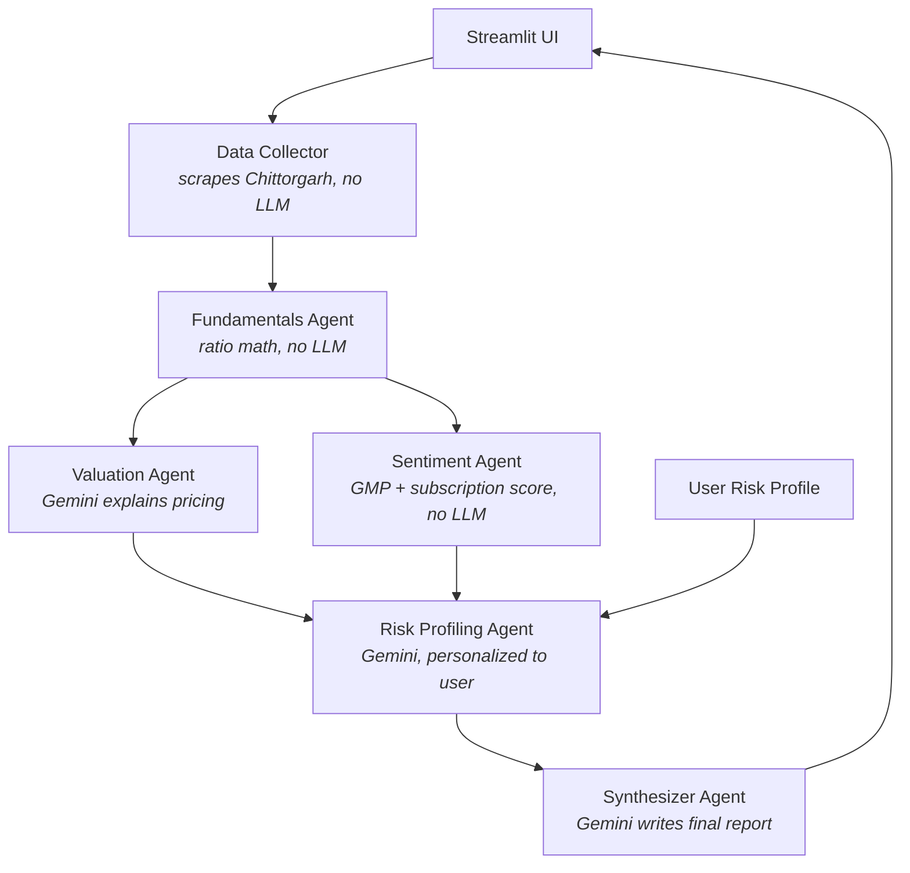

# Indian IPO Analyzer

A multi-agent tool that scrapes live and upcoming Indian IPOs (mainboard + SME), computes real financial and valuation metrics, and produces a **personalized, explained** suitability report — not just a buy/avoid call.

Built with [LangGraph](https://github.com/langchain-ai/langgraph) for agent orchestration and [Gemini](https://ai.google.dev/) for the reasoning steps, on top of deterministic, unit-tested financial math.

## Live demo at https://ipoanalyzer.streamlit.app/

> ⚠️ **Not financial advice.** GMP, subscription figures, and disclosed financials change quickly and scraped data can go stale. Always cross-check against the RHP/DRHP on SEBI/exchange sites before investing.

---

## Why this exists

Most IPO trackers show you numbers. Almost none explain *why* those numbers matter, or whether an IPO actually fits **your** risk profile versus someone else's. This project does both:

- Pulls live IPO data instead of relying on a static/manual dataset
- Runs the data through six specialist agents instead of one LLM call doing everything
- Every LLM-generated claim is grounded in numbers computed by plain, testable Python — the model explains, it doesn't invent
- The final verdict is personalized against your stated investment amount, risk appetite, horizon, and experience, not a generic "good IPO" score

## Features

-  **Live data** — scrapes Chittorgarh for the current IPO calendar, price bands, lot sizes, RHP financial disclosures, subscription figures, and grey market premium (GMP) trend
-  **Real financial analysis** — P/E, P/B, ROE, ROCE, debt-to-equity, revenue CAGR, and profit margins, computed from disclosed financials
-  **Multi-agent pipeline** — six specialist agents (data collection, fundamentals, valuation, sentiment, risk profiling, synthesis) instead of one LLM doing everything end-to-end
-  **Personalized suitability** — matches IPO risk characteristics against your investment amount, risk appetite, horizon, and experience level
-  **Explained, not just recommended** — every section of the report explains the mechanics behind the number, with an in-app metrics glossary
-  **Offline demo mode** — explore the full UI and agent pipeline with sample data before wiring up live scraping or an API key

## Architecture



Only 3 of the 6 stages ever touch an LLM. Ratios, GMP math, and subscription scoring are pure, unit-tested arithmetic — Gemini's job is to *explain* numbers that code already computed, never to invent them. That means the report can't silently drift from the underlying data, and the verdict is reproducible given the same inputs.

| Agent | Uses Gemini? | Responsibility |
|---|:---:|---|
| Data collector | ❌ | Scrapes IPO calendar, financials, GMP, subscription data from Chittorgarh |
| Fundamentals | ❌ | Computes P/E, P/B, ROE, ROCE, debt/equity, revenue CAGR, margins |
| Valuation | ✅ | Explains what the ratios mean; the rich/fair/attractive **verdict itself is rule-based**, not LLM output |
| Sentiment | ❌ | Scores GMP trend + weighted QIB/NII/retail subscription momentum |
| Risk profiling | ✅ | Deterministic risk score from concrete red flags; Gemini explains which factors matter for *your* profile |
| Synthesizer | ✅ | Combines everything into the final report — instructed never to override upstream numbers |

## Tech stack

| Layer | Choice |
|---|---|
| Orchestration | LangGraph (fan-out/fan-in multi-agent graph) |
| LLM | Google Gemini via `langchain-google-genai` |
| UI | Streamlit |
| Data validation | Pydantic v2 |
| Scraping | `requests` + `BeautifulSoup` |
| Testing | `pytest` |

## Getting started

### Prerequisites
- Python 3.10+
- A free [Gemini API key](https://aistudio.google.com/apikey)

### Installation

```bash
git clone https://github.com/<your-username>/ipo-analyzer.git
cd ipo-analyzer
python -m venv venv && source venv/bin/activate   # Windows: venv\Scripts\activate
pip install -r requirements.txt
cp .env.example .env   # then add your GEMINI_API_KEY
streamlit run app.py
```

Open the URL Streamlit prints (usually `http://localhost:8501`).

### Try it without any setup

Toggle **"Use demo data"** in the sidebar to explore the full UI and agent pipeline with three realistic sample IPOs — no scraping and no API key needed for the layout, though the Gemini-powered agents still need a key to actually run.

## Project structure

```
ipo_analyzer/
├── app.py                       Streamlit entry point
├── state.py                     Shared LangGraph state schema
├── agents/
│   ├── graph.py                 LangGraph wiring (fan-out/fan-in pipeline)
│   ├── fundamentals_agent.py    Deterministic ratio calculations
│   ├── valuation_agent.py       Rule-based verdict + Gemini explanation
│   ├── sentiment_agent.py       GMP + subscription scoring
│   ├── risk_agent.py            Risk scoring + personalized explanation
│   └── synthesizer_agent.py     Final report generation
├── scrapers/
│   ├── models.py                Pydantic schemas for all IPO data
│   ├── chittorgarh_scraper.py   Live data source
│   └── demo_data.py             Offline sample data
├── utils/
│   ├── financial_calcs.py       Pure, unit-tested ratio math
│   └── gemini_client.py         LLM wrapper + response normalization
└── tests/
    └── test_financial_calcs.py  9 unit tests, no network required
```

## Metric glossary

<details>
<summary>Click to expand — also shown inline in the app</summary>

- **P/E (Price-to-Earnings)** — price paid per rupee of annual profit. Only meaningful compared against sector peers.
- **P/B (Price-to-Book)** — price vs. net asset value per share. Matters more for asset-heavy businesses (banks, manufacturing) than asset-light ones (SaaS, services).
- **ROE (Return on Equity)** — profit per rupee of shareholder capital. >15% is generally healthy for Indian mainboard companies, sector-dependent.
- **ROCE (Return on Capital Employed)** — profitability vs. *all* capital (equity + debt) — fairer than ROE for leveraged companies.
- **Debt-to-Equity** — >1 means the company owes more than shareholders invested; higher financial risk.
- **Revenue CAGR** — compound annual growth rate across disclosed fiscal years.
- **GMP (Grey Market Premium)** — an unofficial, unregulated secondary indicator of listing-day demand, traded outside SEBI's purview. Treated as a sentiment signal here, never a valuation input, since it can swing sharply or vanish before listing.
- **Subscription multiple (QIB/NII/Retail)** — how many times a category was subscribed. QIB (institutional) demand is weighted highest in this tool's sentiment score, since QIBs typically do the deepest diligence.

</details>

## Known limitations

- **Scraping is fragile by nature.** Chittorgarh's HTML can change at any time. All CSS selectors live in one place (`SELECTORS` in `scrapers/chittorgarh_scraper.py`) so a break is usually a one-line fix — see the Troubleshooting section in that file's docstring.
- **NSE/BSE direct integration isn't implemented.** NSE in particular requires session-cookie bootstrapping and aggressively rate-limits scripted access. Chittorgarh already aggregates NSE + BSE mainboard and SME data, so it's the practical single source for now.
- **GMP is not a valuation signal.** It's included because it's genuinely useful for gauging listing-day sentiment, but the app is explicit that it's unregulated and can vanish before listing.

## Roadmap

- [ ] Sector-relative valuation (scrape peer P/E medians instead of using fixed thresholds)
- [ ] Anchor investor quality scoring
- [ ] SME kostak-rate tracking (schema already supports it)
- [ ] NSE/BSE direct scraping as an official-source cross-check

## Disclaimer

This tool is for educational purposes only and does not constitute investment advice. IPO investing carries risk, including loss of capital. The author is not a SEBI-registered investment advisor. Always do your own research and consult a qualified financial advisor before investing.

## License

[MIT](LICENSE)